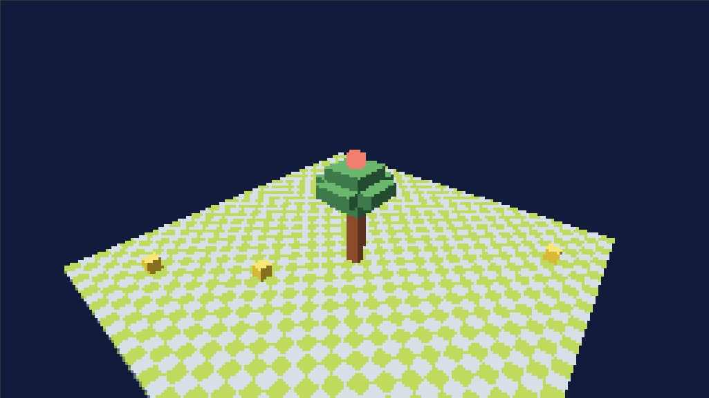

# voxlconsl

> A fantasy console where the only graphics primitive is a voxel.

[](https://joeleaver.github.io/voxlconsl/)

[](https://github.com/joeleaver/voxlconsl/actions/workflows/deploy-pages.yml)
[](#license)
[](#status)

**[Try it live →](https://joeleaver.github.io/voxlconsl/)** &nbsp;·&nbsp;
**[Documentation](https://joeleaver.github.io/voxlconsl/)** &nbsp;·&nbsp;
**[Specification](SPEC.md)** &nbsp;·&nbsp;
**[Roadmap](https://joeleaver.github.io/voxlconsl/roadmap.html)**

---

voxlconsl is a fantasy console — a virtual machine with deliberately small,
deliberately specific constraints — where every visible thing is made of
voxels. There are no sprites, no triangles, no textures. There is one
primitive, and the platform's identity is what falls out of using it
exclusively.

The constraints aren't there to be quaint. They're there because
constraint shapes a medium: PICO-8 looks like PICO-8 because of its 16
colors and 128×128 screen; the Game Boy looks like the Game Boy because
of its green-tinted 4-shade palette. voxlconsl is staking out the same
territory in 3D.

## What's special about it

| | |
|---|---|
| **World** | A single 1024 × 1024 × 1024 voxel grid |
| **Output** | 256 × 144 framebuffer, 60 Hz, ray-marched on the CPU |
| **Color** | 64-color fixed system palette, 16 ramps × 4 shades, lighting via shade-shift |
| **Audio** | Cart-defined synth + sampler patches driven by MIDI, with runtime patch editing |
| **Input** | Action-based — same cart runs unchanged on browser, touch-only mobile, and physical handheld |
| **Cart code** | WebAssembly. Rust is the reference cart language; any language with a WASM target works |
| **Cart size** | 32 MB cap |
| **Hardware target** | ESP32-P4 tier eventually; the browser is the conformance reference |

## Three things that make voxlconsl distinctive

1. **GPU-less ray-marched voxels.** Every port — browser, future
   ESP32-P4 handheld — uses the same CPU SVO ray marcher. Identical
   pixels everywhere.
2. **Cellular automata as a first-class platform feature.** Sand,
   water, fire, gas, and flammable materials are tagged in the
   material table; the host runs them via a sparse active-set
   simulator with deterministic ordering for replay.
3. **Action-based input.** Carts declare gameplay verbs ("move",
   "fire", "menu") and the port maps physical inputs to them. Same
   cart, three completely different input topologies.

## Quick start

Prerequisites: a recent stable Rust, the wasm32 target, a static HTTP
server.

```sh
rustup target add wasm32-unknown-unknown
cargo install wasm-bindgen-cli --version 0.2.100

git clone https://github.com/joeleaver/voxlconsl
cd voxlconsl
./scripts/build-web.sh release
python3 -m http.server 8765 --directory web
```

Open <http://localhost:8765/> — you should see the same scene as the
[live site](https://joeleaver.github.io/voxlconsl/), running locally
out of the `hello-cube` example cart.

For the full setup, including the docs site build, see the
[Quick Start in the docs](https://joeleaver.github.io/voxlconsl/quick-start.html).

## Repository layout

```
voxlconsl/
├── SPEC.md                  # the platform specification (v0.1)
├── crates/
│   ├── types/               # shared types: Vec3, Material, ActionDecl, ...
│   ├── svo/                 # sparse voxel octree (§13 of the spec)
│   ├── host/                # runtime: renderer, palette, audio, physics, sandbox
│   ├── host-browser/        # browser port (wasm32 cdylib)
│   ├── sdk/                 # cart-side crate (no_std)
│   ├── bundler/             # `.voxl` cart bundler (skeleton)
│   └── cli/                 # `voxlconsl` binary (skeleton)
├── examples/
│   └── hello-cube/          # first cart — 3.5 KB no_std WASM
├── docs/                    # mdBook site published to GitHub Pages
├── web/                     # browser shell — index.html, main.js, style.css
└── scripts/
    └── build-web.sh         # build cart, build host, run wasm-bindgen
```

The full crate dependency graph and module-to-spec mapping is in the
[Project Layout doc](https://joeleaver.github.io/voxlconsl/project-layout.html).

## Authoring a cart

```rust
#![no_std]
#![no_main]

use voxlconsl_sdk::*;

#[unsafe(no_mangle)]
pub extern "C" fn init() {
    material_define(1, Material::pack_color(/* sky_blue */ 6, 1), 0, MaterialFlags::empty());
    fill_box(UVec3::new(0, 0, 0), UVec3::new(31, 0, 31), 1);
    sky_set_gradient(Material::pack_color(7, 0), Material::pack_color(6, 0));
    light_set_sun(Vec3::new(-0.6, 0.8, 0.4), 0, 0);
}

#[unsafe(no_mangle)]
pub extern "C" fn update(_dt_ms: u32) {}

#[unsafe(no_mangle)]
pub extern "C" fn render() {
    camera_set_lookat(
        Vec3::new(50.0, 30.0, 50.0),
        Vec3::new(16.0, 1.0, 16.0),
        Vec3::Y,
    );
    camera_set_fov(60.0);
}

#[panic_handler]
fn panic(_info: &core::panic::PanicInfo) -> ! { loop {} }
```

Walkthrough of the full `hello-cube` cart, including action declaration
and input handling, is in the
[hello-cube docs page](https://joeleaver.github.io/voxlconsl/hello-cube.html).

## Status

**Pre-alpha.** The [specification](SPEC.md) is mostly locked at v0.1 — most
load-bearing decisions are made and written down. Implementation is just
starting; the [live emulator](https://joeleaver.github.io/voxlconsl/) is
what runs today:

- Sparse voxel octree per the spec, ~1,000 lines of Rust, ray-marched
  at 60 Hz in the browser.
- Action-based input working end-to-end (browser → host → cart and back).
- A 3.5 KB `hello-cube` cart exercising the full SDK surface.
- Cart sandbox running on `wasmi` inside the host's own WASM.

Audio, physics, multi-chunk worlds, and a real `.voxl` cart-format
parser are the next milestones. See the
[roadmap](https://joeleaver.github.io/voxlconsl/roadmap.html) for what's
planned and what's deliberately out of scope (soft-body sim,
network-multiplayer, GPU rendering).

## License

Dual-licensed under MIT or Apache-2.0, at your option.

The project is in early development; expect breaking changes.
